# Agentic Workflow Platform Design

## 0. 文档目标

本文档描述一个面向企业复杂任务的 Agentic Workflow Platform 第一版总体架构设计。

平台定位不是低代码 LLM 应用搭建器，也不是 SaaS 自动化编排工具，而是一个可靠、可治理、可演进的 Agentic Process Runtime。

核心设计哲学：

> Workflow 提供业务生命周期边界，Policy 提供治理约束，Agent 在被授权的范围内自主完成阶段目标。

也可以表述为：

- Workflow 规定“有哪些阶段，以及阶段之间允许如何转换”。
- Agent 决定“在某个阶段内如何根据目标、状态、skills、tools、models 完成任务”。
- Policy 决定“什么情况下允许这么做、是否需要审批、是否超出预算或权限”。

更准确地说，AgentRail 不是把 Agent 简单塞进 Workflow，而是面向企业长生命周期、多系统、高审计要求任务的 **Workflow 约束下的 Agentic Process Runtime**。

适合场景：

- 业务过程有稳定阶段，但阶段内部需要搜索、判断、创造、反思和工具使用。
- 业务希望尽可能自动化，但必须保留质量门槛、风险边界和人工接管。
- 任务涉及多个系统、较长生命周期、失败恢复、审计追踪和责任归属。
- 例如内容生产、合同审核、风控审核、工单处理、运维处置、财务对账、合规检查。

非目标场景：

- 简单聊天机器人。
- 轻量 RAG 应用。
- 一次性自动化脚本。
- 完全开放式个人助理。
- 不需要审计、恢复、治理的临时探索型 Agent。

## 1. 领域模型与统一语言

### 1.1 限界上下文

第一版领域模型划分为以下限界上下文：

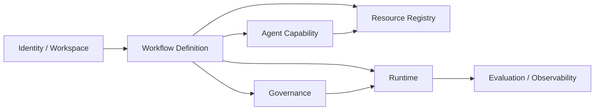

各上下文职责：

- `Identity / Workspace`：租户、空间、用户、角色和权限边界。
- `Workflow Definition`：业务流程身份、版本、图结构、节点、边、发布快照。
- `Agent Capability`：Agent、Skill、Prompt 等智能执行能力。
- `Resource Registry`：Tool、MCP Server、Model Provider、Connection、Secret 等可调用资源。
- `Governance`：Policy、Approval、Budget、Data Governance、Permission 等治理规则。
- `Runtime`：Run、StepRun、Invocation、StateSnapshot、Artifact、HumanTask、TransitionDecision。
- `Evaluation / Observability`：Trace、Event、Cost、Evaluation、Replay、Metrics。

### 1.2 核心统一语言

#### Workflow

Workflow 是业务生命周期模型，定义一次任务可能经历的阶段，以及阶段之间允许的转换空间。

Workflow 不等同于固定 DAG。它可以包含条件边、人工选择、Agent 输出驱动的路由、异常跳转和回退路径。

#### Node

Workflow Node 是业务阶段节点，不是 Agent 内部的每一步思考或工具调用。

典型节点类型：

- `agent`：由 Agent 执行阶段目标。
- `tool`：调用一个已注册工具。
- `model`：直接调用模型能力。
- `human`：等待人工审批、补充、接管或确认。
- `condition`：根据结构化状态或规则进行判断。
- `router`：根据条件、Agent 输出或 Policy 结果选择下一条边。
- `subflow`：启动子流程。
- `wait`：等待时间、事件或外部 signal。
- `evaluator`：对结果进行评估或校验。

Workflow Node 的粒度原则：

> Workflow Node = 业务阶段边界；Agent Step = 运行时执行轨迹；Tool Invocation = 外部能力调用记录。

一个步骤是否应该成为 Workflow Node，可以用以下问题判断：

- 是否有独立业务产物，例如候选选题列表、大纲、审核报告、发布结果。
- 是否需要独立质量判断，例如评分、风险等级、合规结果。
- 是否可能需要人工介入，例如复核、审批、补充信息、接管。
- 是否有不同的权限、预算、SLA 或风险边界。
- 失败后是否值得单独重试、回退或补偿。

如果一个步骤主要是模型内部推理、工具调用、数据清洗、局部改写或中间总结，则不应该建模为 Workflow Node，而应该作为 Agent Trace / Invocation 记录。

#### Edge

Workflow Edge 定义阶段之间的合法转换空间。一次运行是否走某条边，由 condition、agent output、policy result、human decision 或 system event 决定。

Agent 可以影响流转，但不能突破 Workflow 定义的合法转换空间。

#### Agent

Agent 是一种阶段执行形态。Agent 在某个 Workflow Node 内部运行，根据目标、上下文、skills、tools、models 和 policies 动态推进任务。

Agent 的内部执行过程可以使用 LangGraph 表达，但平台领域模型不直接等同于 LangGraph 的 node/edge。

#### Skill

Skill 是可复用能力包，封装某类任务的指令、经验、约束、示例、依赖工具和适用边界。

Skill 不是简单 prompt，而是 Agent 能力组合的一部分。

#### Tool

Tool 是平台统一调用外部能力的抽象，包括普通函数、HTTP/API、MCP 工具、数据库操作、内部平台工具等。

Tool 必须有 schema、权限、超时、幂等、审计和失败语义。

#### Model

Model 是模型能力资源，覆盖语言模型、embedding、图片生成、视频生成、多模态理解等。

平台通过 `ModelProvider` 和 `ModelProfile` 描述供应商、具体模型、能力、成本、限流和路由规则。

#### Policy

Policy 是治理规则集合，控制权限、预算、审批、数据处理、模型路由、工具调用和风险处置。

Policy 是 Agent 自主性的边界。

#### Run

Run 是某个 `WorkflowVersion` 的一次真实执行实例。Run 必须绑定不可变版本，而不是直接绑定可变的 `WorkflowDefinition`。

### 1.3 领域模型总览

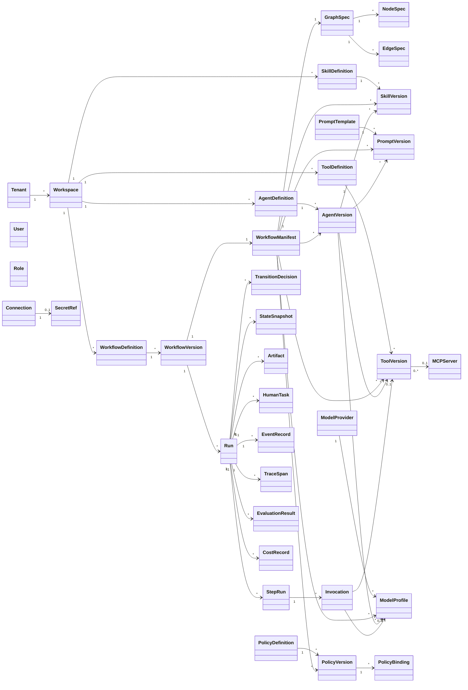

## 2. 核心模型字段与生命周期

### 2.1 WorkflowDefinition

`WorkflowDefinition` 表示一个长期存在的业务流程资产。

关键字段：

```yaml
WorkflowDefinition:
  id: string
  workspaceId: string
  key: string
  name: string
  description: string
  owner: string
  tags: string[]
  lifecycleStatus: draft | active | deprecated | archived
  createdAt: datetime
  updatedAt: datetime
```

生命周期：

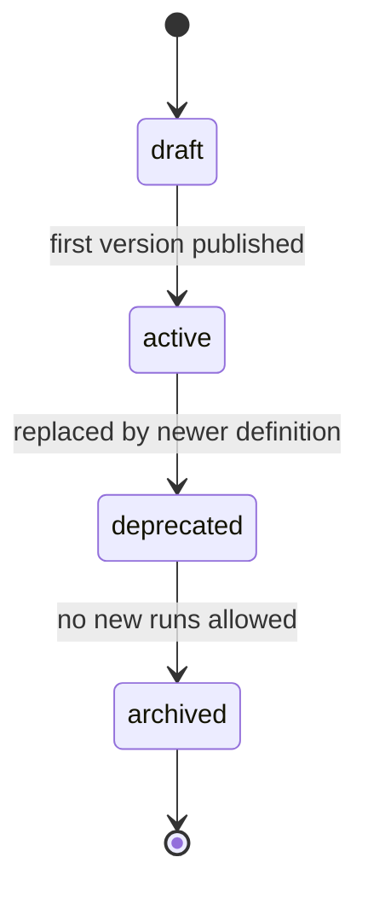

说明：

- `WorkflowDefinition` 管身份和生命周期。
- 它本身不应该承载可执行图。
- 可执行内容必须进入 `WorkflowVersion`。

### 2.2 WorkflowVersion

`WorkflowVersion` 表示某个 Workflow 的不可变发布版本。

关键字段：

```yaml
WorkflowVersion:
  id: string
  workflowDefinitionId: string
  version: string
  status: draft | published | deprecated | revoked
  manifestId: string
  checksum: string
  changeSummary: string
  publishedBy: string
  publishedAt: datetime
  createdAt: datetime
```

生命周期：

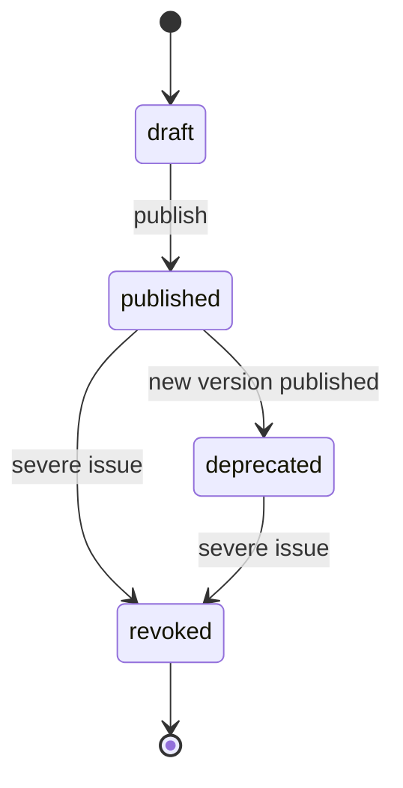

约束：

- `published` 后不可变。
- Run 只能绑定 `published` 或按策略允许的 `deprecated` 版本。
- `revoked` 版本不允许新建 Run，但已运行实例如何处理由迁移策略决定。

### 2.3 WorkflowManifest

`WorkflowManifest` 是一次发布的完整依赖快照。

它避免 `WorkflowVersion` 直接散乱引用大量 asset version，也便于回放、审计、灰度和回滚。

关键字段：

```yaml
WorkflowManifest:
  id: string
  workflowVersionId: string
  graphSpecId: string
  agentBindings:
    - alias: string
      agentVersionId: string
  skillBindings:
    - alias: string
      skillVersionId: string
  toolBindings:
    - alias: string
      toolVersionId: string
  modelBindings:
    - alias: string
      modelProfileId: string
      usage: default | fallback | high_reasoning | vision | image_generation | video_generation
  promptBindings:
    - alias: string
      promptVersionId: string
  policyBindings:
    - policyVersionId: string
      scopeType: workflow | node | agent | tool | model
      scopeRef: string
      priority: number
  createdAt: datetime
```

### 2.4 GraphSpec / NodeSpec / EdgeSpec

`GraphSpec` 是 WorkflowVersion 的业务阶段图。

第一版 `GraphSpec` 保持扁平结构，不支持嵌套 graph。流程复用和组合通过 `subflow` node 表达，`subflow` 指向另一个独立发布的 `WorkflowVersion`。

关键字段：

```yaml
GraphSpec:
  id: string
  entryNodeId: string
  inputSchema: json_schema
  outputSchema: json_schema
  stateSchema: json_schema
  nodes: NodeSpec[]
  edges: EdgeSpec[]
```

`NodeSpec` 是业务阶段与执行器之间的桥。

```yaml
NodeSpec:
  id: string
  key: string
  name: string
  type: agent | tool | model | human | condition | router | subflow | wait | evaluator | end
  executorRef:
    kind: agent | tool | model | human | system
    ref: string
  config: object
  inputMapping: object
  outputMapping: object
  retryPolicyRef: string
  timeoutPolicyRef: string
  checkpointPolicy:
    beforeExecute: boolean
    afterExecute: boolean
  transitionStrategy: explicit_edges | condition_based | agent_suggested | policy_routed
```

`EdgeSpec` 定义合法转换空间。

```yaml
EdgeSpec:
  id: string
  sourceNodeId: string
  targetNodeId: string
  condition:
    expression: string
    inputRefs: string[]
  priority: number
  label: string
```

设计约束：

- Workflow Node 是业务阶段，不是 Agent 内部 step。
- Edge 定义合法转换空间，不代表每次一定执行。
- Agent 可以输出 transition signal，但最终必须被 Edge 和 Policy 校验。
- GraphSpec 第一版不支持嵌套 graph，避免父子 graph 的版本、状态作用域、可视化和恢复语义过早复杂化。
- `subflow` node 是组合流程的唯一入口，子流程拥有独立的 WorkflowVersion、Run、状态和审计记录。

`subflow` node 的典型配置：

```yaml
SubflowNodeConfig:
  workflowDefinitionId: string
  workflowVersionId: string
  inputMapping: object
  outputMapping: object
  waitStrategy: wait_until_completed | fire_and_forget
  failureStrategy: fail_parent | continue_with_error | route_by_error
```

### 2.5 AgentDefinition / AgentVersion

`AgentDefinition` 是 Agent 资产身份，`AgentVersion` 是不可变 Agent 能力版本。

关键字段：

```yaml
AgentVersion:
  id: string
  agentDefinitionId: string
  version: string
  role: string
  goal: string
  systemInstruction: string
  promptRefs: string[]
  skillRefs: string[]
  toolRefs: string[]
  modelPolicyRef: string
  memoryPolicyRef: string
  planningMode: none | reactive | plan_execute | multi_agent
  maxIterations: number
  stopCondition:
    type: output_schema_matched | confidence_reached | max_iterations | policy_signal | human_stop
    config: object
  outputSchema: json_schema
  status: draft | published | deprecated | revoked
```

生命周期与 `WorkflowVersion` 类似：

- draft：可编辑。
- published：不可变，可被 WorkflowManifest 引用。
- deprecated：不推荐新引用，但兼容旧运行。
- revoked：禁止新引用。

### 2.6 SkillDefinition / SkillVersion

`SkillVersion` 是可复用能力包的不可变版本。

关键字段：

```yaml
SkillVersion:
  id: string
  skillDefinitionId: string
  version: string
  purpose: string
  instructions: string
  examples:
    - input: object
      output: object
      explanation: string
  constraints: string[]
  requiredToolRefs: string[]
  requiredModelCapabilities: string[]
  applicableScenarios: string[]
  antiPatterns: string[]
  status: draft | published | deprecated | revoked
```

说明：

- Skill 可以被多个 AgentVersion 引用。
- Skill 不应该直接持有运行状态。
- Skill 的依赖工具和模型能力必须声明，便于发布校验。

### 2.7 ToolDefinition / ToolVersion

Tool 是统一工具抽象。

关键字段：

```yaml
ToolVersion:
  id: string
  toolDefinitionId: string
  version: string
  type: function | http | mcp | internal | database
  inputSchema: json_schema
  outputSchema: json_schema
  connectionRef: string
  mcpServerRef: string
  mcpToolName: string
  permissionScope: string[]
  sideEffectLevel: none | read | write | destructive | external_commit
  idempotencyPolicy:
    required: boolean
    keyExpression: string
  retryPolicyRef: string
  timeoutPolicyRef: string
  auditLevel: none | metadata | full
  status: draft | published | deprecated | revoked
```

设计约束：

- MCP 工具是 Tool 的一种实现来源，不是独立调用模型。
- 写操作、破坏性操作、外部提交操作必须声明副作用等级。
- Agent 调用 Tool 前必须经过 Policy 校验。

### 2.8 ModelProvider / ModelProfile

`ModelProvider` 表示供应商，`ModelProfile` 表示具体模型能力。

关键字段：

```yaml
ModelProvider:
  id: string
  workspaceId: string
  name: string
  providerType: openai | anthropic | gemini | bedrock | azure_openai | internal | custom
  connectionRef: string
  status: active | disabled

ModelProfile:
  id: string
  providerId: string
  modelName: string
  modality: text | embedding | image_generation | video_generation | audio | multimodal
  capabilities:
    - tool_calling
    - vision
    - structured_output
    - json_mode
    - reasoning
    - streaming
  contextWindow: number
  costPolicyRef: string
  rateLimitPolicyRef: string
  dataPolicyRef: string
  status: active | disabled | deprecated
```

### 2.9 PolicyDefinition / PolicyVersion / PolicyBinding

Policy 通过 Binding 作用到不同范围。

关键字段：

```yaml
PolicyVersion:
  id: string
  policyDefinitionId: string
  version: string
  type: permission | budget | approval | risk | model_routing | tool_invocation | data_governance | retention
  rules: object
  effect: allow | deny | require_approval | route_to | mask_data | limit | escalate
  status: draft | published | deprecated | revoked

PolicyBinding:
  id: string
  policyVersionId: string
  scopeType: tenant | workspace | workflow | workflow_version | node | agent | tool | model
  scopeRef: string
  priority: number
  enabled: boolean
```

设计约束：

- Policy 可继承、可覆盖，但必须有明确优先级。
- 高风险操作默认 deny，必须显式 allow 或 require approval。
- Policy 判断结果需要进入 EventRecord 和 TraceSpan。

### 2.10 Run / StepRun / Invocation

`Run` 是一次真实执行。

```yaml
Run:
  id: string
  workflowVersionId: string
  temporalWorkflowId: string
  status: pending | running | waiting | suspended | completed | failed | canceled
  input: object
  output: object
  currentNodeId: string
  startedBy: string
  startedAt: datetime
  endedAt: datetime
```

`StepRun` 是某个 Workflow Node 的一次执行。

```yaml
StepRun:
  id: string
  runId: string
  nodeSpecId: string
  status: pending | running | waiting | completed | failed | skipped | canceled
  attempt: number
  input: object
  output: object
  error:
    code: string
    message: string
    category: model | tool | policy | system | business | timeout
  startedAt: datetime
  endedAt: datetime
```

`Invocation` 是 StepRun 内部对模型或工具的一次调用。

```yaml
Invocation:
  id: string
  stepRunId: string
  kind: model | tool | skill | internal
  targetRef: string
  input: object
  output: object
  status: completed | failed | denied | waiting_approval
  cost:
    tokens: number
    amount: number
    currency: string
  latencyMs: number
  policyDecisionRef: string
```

### 2.11 TransitionDecision

`TransitionDecision` 记录一次阶段转换决策。

```yaml
TransitionDecision:
  id: string
  runId: string
  fromNodeId: string
  candidateEdgeIds: string[]
  selectedEdgeId: string
  decidedBy: condition | agent | policy | human | system
  decisionSignal: object
  policyResult: object
  reason: string
  createdAt: datetime
```

说明：

- Agent 可以产生 `decisionSignal`。
- Runtime 必须校验 selected edge 是否在 candidate edges 内。
- Policy 可以覆盖 Agent 建议，例如强制进入人工复核。

### 2.12 StateSnapshot / Artifact / HumanTask

`StateSnapshot` 用于恢复和查询。

```yaml
StateSnapshot:
  id: string
  runId: string
  stepRunId: string
  checkpointKey: string
  state: object
  schemaVersion: string
  snapshotType: workflow_node | agent_checkpoint | human_wait | failure | takeover
  createdAt: datetime
```

状态边界：

- Temporal history 负责可靠执行恢复、timer、retry、signal 和 workflow task 调度。
- Postgres 中的 `StateSnapshot` / `agent_checkpoints` 负责平台查询、调试、人工接管、回放辅助和 Agent runtime checkpoint。
- 不依赖 Temporal 作为业务状态查询源；业务系统和 Console 只通过数据面 API 查询 Postgres 中的运行态。

默认 checkpoint 策略：

- 必须保存：Run 启动时、每个 Workflow Node 执行前后、Agent Node 完成后、HumanTask 等待前、失败/重试/人工接管前。
- 可选保存：Agent 内部关键 step、长循环每 N 次迭代、高风险工具调用前后。
- Agent 内部步骤不默认写完整 snapshot，避免数据量失控；是否保存由 NodeSpec 的 `checkpointPolicy` 决定。

`Artifact` 表示运行产物。

```yaml
Artifact:
  id: string
  runId: string
  stepRunId: string
  type: text | json | file | image | video | audio | report
  uri: string
  metadata: object
  visibility: private | workspace | external
  createdAt: datetime
```

`HumanTask` 表示人工介入点。

```yaml
HumanTask:
  id: string
  runId: string
  stepRunId: string
  type: approval | input_request | review | takeover | correction
  status: pending | claimed | completed | rejected | expired | canceled
  assignee: string
  payload: object
  result: object
  dueAt: datetime
  createdAt: datetime
  completedAt: datetime
```

### 2.13 TraceSpan

`TraceSpan` 是 AgentRail 平台统一追踪模型，用于记录 workflow node、agent step、model call、tool call、policy check、evaluator、human wait 等运行轨迹。

TraceSpan 不直接暴露 LangGraph 的内部 trace 结构。LangGraph 是当前 AgentExecutor 的实现之一，其 trace 需要映射为平台统一 `TraceSpan`。

关键字段：

```yaml
TraceSpan:
  id: string
  runId: string
  stepRunId: string
  parentSpanId: string
  spanType: workflow_node | agent_step | model_call | tool_call | policy_check | evaluator | human_wait | system
  name: string
  status: running | completed | failed | canceled
  input: object
  output: object
  error:
    code: string
    message: string
    category: model | tool | policy | system | business | timeout
  metadata: object
  startedAt: datetime
  endedAt: datetime
```

映射规则：

- Workflow Node 执行对应 `spanType=workflow_node`。
- LangGraph node execution 对应 `spanType=agent_step`。
- LLM 调用对应 `spanType=model_call`。
- Tool 调用对应 `spanType=tool_call`。
- Policy 判断对应 `spanType=policy_check`。
- Evaluator 执行对应 `spanType=evaluator`。
- HumanTask 等待对应 `spanType=human_wait`。

第一版 TraceSpan 直接写入 Postgres。后续如需接入 OpenTelemetry、专用 tracing backend 或 OLAP，可以通过异步同步实现，不改变平台 TraceSpan 领域模型。

## 3. 总体架构

### 3.1 架构原则

- 定义态和运行态分离。
- 可变定义和不可变版本分离。
- Workflow Graph 是平台领域模型，LangGraph 是 AgentExecutor 的实现选项。
- Temporal 负责可靠执行，业务 DB 负责定义、查询态、快照、产物和审计索引。
- Worker 尽量通用化，新增业务流程不需要新增专用 worker；但新增平台能力类型时可以扩展 NodeExecutor、ToolAdapter、ModelProvider 或 AgentExecutor。
- 外部副作用统一通过 Tool / Activity 层治理。
- `agentrail-service` 不直接 RPC 调用 `agentrail-worker`；二者通过 Temporal 调度和 Postgres 查询态解耦。
- Worker 不是任意 Agent 程序的解释器，不执行用户自定义代码，不承诺运行任意 Agent framework。

### 3.2 总体组件图

平台逻辑上分为 **控制面（管理）**、**数据面（运行时数据与编排控制）**、**执行面（Agent 执行）** 三层。模型调用、工具调用、MCP 调用作为执行面内部库存在，不再独立成服务。

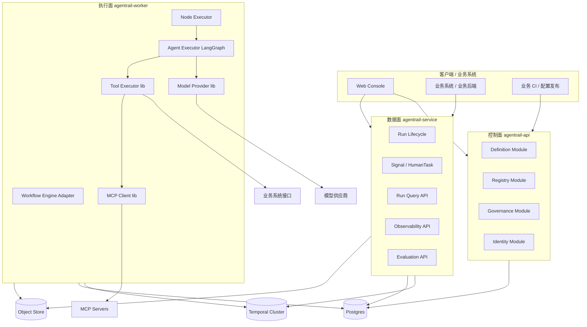

### 3.3 子系统职责

#### 控制面 agentrail-api

管理端 API，负责定义、注册、治理、身份等所有可配置资产的 CRUD 与发布。

内部模块（同进程内）：

- **Definition Module**：管理 WorkflowDefinition、WorkflowVersion、WorkflowManifest、GraphSpec、NodeSpec、EdgeSpec。
- **Registry Module**：管理 Agent、Skill、Prompt、Tool、MCP Server、Model Provider、Connection、Secret。
- **Governance Module**：管理 Policy、PolicyBinding、Approval、Budget、DataPolicy。
- **Identity Module**：Tenant、Workspace、User、Role、Permission。

调用方（控制面是 **开放、可编程的多租户 API**，不只服务于 AgentRail Console）：

- AgentRail Web Console：平台自带的管理 UI。
- 业务方自有后台 / 业务运营平台：通过控制面 API 在自己的产品里管理流程。
- 业务方 CI / GitOps：以代码 / YAML 形式发布流程定义和资产。
- 业务方脚本 / IaC：批量初始化、迁移、运维。

控制面 **不直接驱动 Run，也不承载运行态读写**，所有运行控制和查询由数据面承担。

#### 数据面 agentrail-service

运行时数据与编排控制服务，专注运行态相关能力，是业务系统接入运行时的唯一入口。

主要能力：

- **Run Lifecycle**：创建 Run、暂停、恢复、取消、与 Temporal 交互。
- **Signal / HumanTask**：处理人工审批、补充输入、纠偏、接管、外部事件 signal。
- **Run Query API**：Run / StepRun / Invocation / TransitionDecision / StateSnapshot 查询。
- **Observability API**：Trace、Event、Cost 数据查询。
- **Evaluation API**：评估任务、结果查询、回放入口。

调用方：

- AgentRail Web Console：运行观察、HumanTask 处理、Trace 查看。
- 业务方后端：发起 Run、查询、信号、提交 HumanTask 结果。
- 业务方应用 / 事件源：触发流程或推送事件 signal。

数据面 **不承担定义、注册、治理资产的修改职责**，所有这类操作必须经过控制面 API。

#### 执行面 agentrail-worker

Agent 执行环境，通用 worker，按任务横向扩展，新增业务流程不需要新增 worker 代码。

主要能力：

- **Workflow Engine Adapter**：注册少量稳定的 Temporal workflow/activity 类型，作为通用执行入口。
- **Node Executor**：根据 NodeSpec.type 路由到对应执行器（agent/tool/model/human/condition/router/subflow/wait/evaluator）。
- **Agent Executor**：基于 LangGraph 运行 Agent Node 内部动态逻辑。
- **Tool Executor（lib）**：统一执行 function / HTTP / internal / MCP 工具，包含 schema 校验、幂等、重试、审计。原 Tool Gateway 收回为库。
- **Model Provider（lib）**：统一调用语言、图片、视频、embedding、多模态模型，包含 provider 适配、路由、限流、成本、脱敏。原 Model Gateway 收回为库。
- **MCP Client（lib）**：MCP server 连接管理、tool schema 同步、调用执行。

执行面边界：

- Worker 不是 Agent JVM，不负责解释任意用户代码或任意 Agent framework。
- Worker 只执行平台定义的标准 `NodeSpec` 和受治理的 Tool / Model / Agent Executor。
- 新增业务流程靠发布 `WorkflowVersion`、`AgentVersion`、`SkillVersion`、`ToolVersion`，不新增 worker 代码。
- 新增平台能力类型时，可以显式扩展 `NodeExecutor`、`ToolAdapter`、`ModelProvider` 或 `AgentExecutor`。
- Agent 的自由度只发生在 `agent` node 内部，并受 allowed tools、allowed skills、allowed models、max iterations、budget、output schema、stop condition 和 policy 约束。

#### 与业务系统的关系

业务系统与平台的交互边界比较清晰，分为四类：

1. **业务方管理流程定义 → 控制面 API**：业务方可以通过 AgentRail Console、自有后台、CI / GitOps、脚本等任意方式调用控制面 API，管理自己的 WorkflowDefinition、Agent、Skill、Tool、Policy。
2. **业务系统驱动运行 → 数据面 API**：业务后端通过数据面发起 Run、查询 Run、发送 signal、提交 HumanTask 结果、订阅事件。
3. **执行面 → 业务系统接口**：Agent 在执行过程中通过 Tool 调用业务系统 API、数据库、内部服务，所有调用受 Tool 与 Policy 治理。
4. **执行面 / 数据面 → 业务系统回调**：通过 webhook / 消息 / 内部事件总线把 Run 状态、HumanTask、产物变更回写业务系统。

业务系统不直接访问 Temporal，也不直接访问 Worker；所有运行交互都通过数据面 API，所有定义变更都通过控制面 API。

业务方典型接入姿势：

- **轻量集成**：业务方在 AgentRail Console 维护流程，业务后端只调数据面发起 Run。
- **平台化集成**：业务方有自己的运营后台，通过控制面 API 管理自己的流程定义、Tool、Policy；业务后端通过数据面 API 驱动运行。
- **GitOps 集成**：业务方把流程定义视作代码，通过 CI 把 YAML/JSON 发布到控制面发布出 WorkflowVersion，再通过数据面运行。

### 3.4 技术选型

第一版采用 **Java 控制面/数据面 + Python 执行面 + TypeScript 前端** 的技术路线。

选型原则：

- 控制面和数据面是企业后端系统，重视稳定 API、权限、审计、事务、复杂查询和团队维护效率，优先使用团队更熟悉的 Java 技术栈。
- 执行面是 Agent runtime，重视 LangGraph、LLM SDK、MCP、模型调用、tool execution、checkpoint 和 memory 生态，优先使用 Python 技术栈。
- `agentrail-service` 只作为 Temporal Client 启动、signal、query、cancel workflow；Temporal workflow/activity 逻辑由 Python worker 注册和执行。
- Java 与 Python 不直接 RPC；二者通过 Temporal 调度和 Postgres 查询态解耦。
- 跨语言领域模型必须有统一 schema 来源，避免 Java DTO 与 Python model 漂移。

#### 后端控制面 / 数据面

`agentrail-api` 和 `agentrail-service` 使用：

```text
Language: Java 21
Framework: Spring Boot 3
API: REST + OpenAPI
Security: Spring Security + JWT / OIDC
Database: PostgreSQL 16 + pgvector
Migration: Flyway
DB Access: jOOQ first, MyBatis acceptable if team preference is stronger
Temporal: Temporal Java SDK as client only
Object Storage: S3-compatible client
```

职责边界：

- `agentrail-api`：定义态、注册态、治理态、身份权限的管理 API。
- `agentrail-service`：运行态入口、Run 生命周期、signal、HumanTask、查询、Temporal Client。
- 两个服务都不执行 Agent、模型调用、MCP 调用或业务 Tool 调用。

#### 执行面

`agentrail-worker` 使用：

```text
Language: Python 3.12+
Workflow SDK: Temporal Python SDK
Agent Runtime: LangGraph Python
Schema / Validation: Pydantic v2
DB Access: SQLAlchemy 2 or asyncpg
MCP: Python MCP client
Model SDKs: OpenAI / Anthropic / Gemini / custom providers
Object Storage: boto3 / aioboto3 through S3-compatible abstraction
Package Manager: uv
```

执行面职责：

- 注册平台稳定的 Temporal workflow/activity type。
- 加载 `WorkflowVersion` / `WorkflowManifest`。
- 执行标准 `NodeSpec`。
- 在 `agent` node 内部运行 LangGraph。
- 调用 Tool、MCP、模型供应商和业务系统接口。
- 写入 `StepRun`、`Invocation`、`StateSnapshot`、`TraceSpan`、`CostRecord`。

Temporal 使用约束：

- Workflow 代码只做确定性编排，例如选择节点、调用 activity、等待 signal/timer。
- LLM 调用、Tool 调用、DB 访问、MCP 调用、对象存储访问都必须放在 activity 内。
- `human` / `wait` 节点通过 Temporal signal/timer 表达，不占用 worker 线程。

#### 前端

Web Console 使用：

```text
Language: TypeScript
Framework: React + Vite
UI: Ant Design
Data Fetching: TanStack Query
Routing: TanStack Router or React Router
```

前端主要面向管理后台和运行观察场景，优先选择表单、表格、抽屉、详情页、审批页能力成熟的组件库。

#### 跨语言契约

Java 控制面/数据面和 Python 执行面共同依赖以下领域对象：

- `WorkflowManifest`
- `GraphSpec`
- `NodeSpec`
- `EdgeSpec`
- `AgentVersion`
- `SkillVersion`
- `ToolVersion`
- `ModelProfile`
- `PolicyVersion`
- `Run`
- `StepRun`
- `Invocation`
- `TraceSpan`

第一版采用 **JSON Schema + OpenAPI** 作为统一契约来源：

- 定义态对象中的可扩展配置使用 JSON Schema 约束，存储在 Postgres `jsonb` 字段。
- Java 使用 Jackson / JSON Schema validator 校验，并用 DTO / record 映射关键字段。
- Python 使用 Pydantic model 解析和校验。
- 如果未来 Java 与 Python 之间出现高频 RPC，再评估引入 Protobuf；第一版不引入。

#### 本地开发与部署

本地开发：

```text
Docker Compose
PostgreSQL + pgvector
Temporal
MinIO
agentrail-api
agentrail-service
agentrail-worker
web-console
```

生产部署：

- Kubernetes 作为目标部署环境。
- Helm chart 后置，不作为第一阶段阻塞项。
- `agentrail-worker` 可按租户、队列、模型类别或业务域拆分部署。

#### 观测与测试

观测：

- 第一版平台 trace 使用 `TraceSpan` 直接写 Postgres。
- 服务日志使用结构化 JSON 日志。
- 指标使用 Prometheus client。
- 后续再接入 OpenTelemetry、Loki、Tempo / Jaeger、Grafana。

测试：

- Java：JUnit 5、Testcontainers、Spring Boot Test。
- Python：pytest、pytest-asyncio、Testcontainers。
- 前端：Vitest，必要时引入 Playwright。
- 本地集成测试优先覆盖 Postgres、Temporal、MinIO 和 worker 执行链路。

## 4. 部署架构

### 4.1 第一版部署单元

第一版只部署三个核心服务，加上必要的中间件依赖。

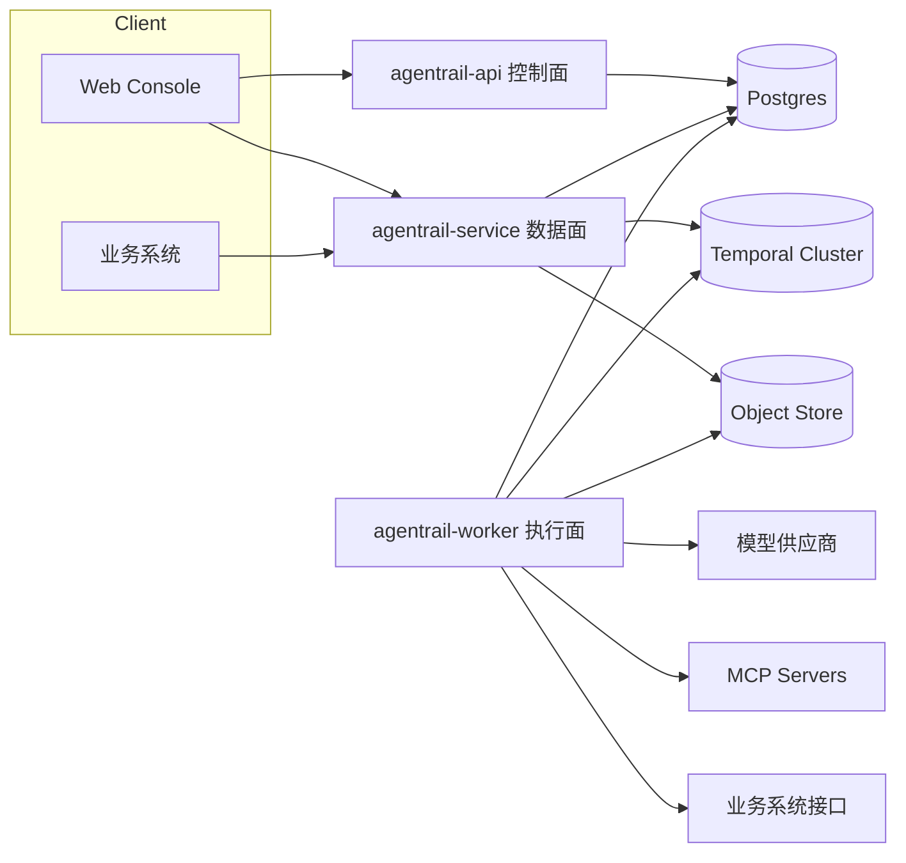

### 4.2 三个核心服务

#### agentrail-api（控制面）

定位：管理端 API，所有定义、注册、治理资产的入口。

部署形态：

- Java 21 + Spring Boot 3 服务。
- 模块化单体进程，水平扩展。
- 无状态，所有数据存 Postgres。

依赖存储：

- **Postgres**：定义态全部数据（WorkflowDefinition / Version / Manifest / Graph / Node / Edge / Agent / Skill / Prompt / Tool / Model / Policy / Identity）。
- **Object Store（可选）**：大字段产物，如 prompt 大文本、流程图截图、调试附件。

不直连 Temporal、不写运行态数据、不调用模型/工具。

#### agentrail-service（数据面）

定位：运行时数据与编排控制服务，业务系统接入运行时的统一入口。

部署形态：

- Java 21 + Spring Boot 3 服务。
- 无状态服务，水平扩展。
- 与 Temporal client 集成，但不执行 workflow 代码本身。

依赖存储：

- **Postgres**：运行态读写（Run / StepRun / Invocation / TransitionDecision / HumanTask / EventRecord）。
- **Temporal**：start workflow、send signal、cancel、query。
- **Object Store**：Artifact 元信息读写、大产物 URL 签发。

不直接调用模型 / MCP / 业务系统，所有副作用都委托给执行面。

#### agentrail-worker（执行面）

定位：通用 Agent 执行环境，所有业务副作用最终在这里发生。

部署形态：

- Python 3.12+ 服务，基于 Temporal Python SDK 和 LangGraph。
- Temporal worker，水平扩展。
- 按租户 / 队列 / 模型类别分组部署，避免相互影响。
- 进程内包含 Node Executor、Agent Executor、Tool Executor、Model Provider、MCP Client 等库。

依赖存储与外部依赖：

- **Postgres**：写 StepRun / Invocation / StateSnapshot / EventRecord / CostRecord，并承载 LangGraph checkpoint、thread state、memory 和 embedding 数据。
- **Temporal**：拉取 workflow task / activity task。
- **Object Store**：写 Artifact 大对象，如生成图片、视频、报告。
- **模型供应商**：通过 Model Provider lib 调用 OpenAI、Anthropic、Gemini、自建模型等。
- **MCP Servers**：通过 MCP Client lib 调用 MCP 工具。
- **业务系统接口**：通过 Tool Executor 按 ToolDefinition 调用业务 API、数据库、内部服务。

### 4.3 服务与存储依赖矩阵

```text
                     Postgres   Temporal   Object Store   外部模型   MCP Server   业务系统
agentrail-api          R/W         -            R/W           -          -            -
agentrail-service      R/W       R/W            R/W           -          -            -
agentrail-worker       R/W       R/W            R/W          R/W        R/W          R/W
```

说明：

- Postgres 是第一版唯一平台数据库，控制面、数据面和执行面共同依赖。
- 控制面只负责定义态数据，不读 Temporal、不写运行态。
- 数据面负责运行态读写与 Temporal 控制，但不产生外部副作用。
- 执行面是唯一直连模型、MCP、业务系统的层，所有副作用都汇聚于此。
- Vector DB / OLAP 不作为第一版默认部署依赖。长期记忆、embedding、checkpoint 先落 Postgres；当检索规模、分析规模或性能瓶颈明确后，再引入专用存储。

### 4.4 与业务系统的部署关系

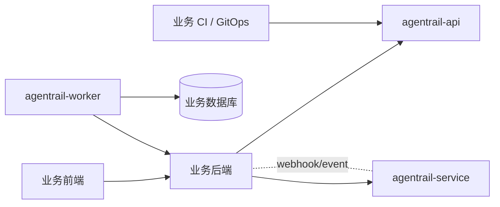

四种典型交互：

1. **业务后端 → 控制面 API**：管理自己的流程定义、Agent、Skill、Tool、Policy（也可通过 CI / GitOps 自动化发布）。
2. **业务后端 → 数据面 API**：发起 Run、查询状态、发送 signal、提交 HumanTask 结果。
3. **执行面 → 业务后端 / 业务数据库**：作为 Tool 在 Agent 执行过程中被调用，受 Tool 与 Policy 治理。
4. **数据面 → 业务后端**：通过 webhook / 消息 / 事件总线回调 Run 状态、HumanTask 待办、异常升级、产物变更。

定义流量与运行流量物理隔离：

- 控制面承接低频、变更敏感的定义流量，故障不影响运行。
- 数据面承接高频运行时流量，可独立弹性扩展。
- 执行面承接所有副作用，按租户 / 队列 / 模型类别隔离部署。

## 5. 数据架构和数据结构

### 5.1 数据存储分工

第一版采用 **一库优先** 策略：Postgres 是唯一平台数据库，承载定义态、运行态、查询态、Agent checkpoint、memory 和 embedding。对象存储只用于大对象和二进制产物，Temporal 只用于可靠执行历史和任务调度。

```mermaid
flowchart TB
  Temporal[(Temporal)]
  Postgres[(Postgres / Platform DB)]
  ObjectStore[(Object Store)]

  Temporal --> T1[Workflow execution history]
  Temporal --> T2[Timers / retries / signals]
  Temporal --> T3[Workflow task scheduling]

  Postgres --> P1[Definitions and versions]
  Postgres --> P2[Run query state]
  Postgres --> P3[StepRun / Invocation]
  Postgres --> P4[Policy / registry / bindings]
  Postgres --> P5[StateSnapshot / checkpoint]
  Postgres --> P6[Agent memory / embeddings]
  Postgres --> P7[Trace / cost / evaluation]

  ObjectStore --> O1[Large artifacts]
  ObjectStore --> O2[Images / videos / reports]
  ObjectStore --> O3[Large traces]
```

可选扩展：

- 当长期记忆和知识检索规模扩大后，可以引入 Vector DB，但领域模型仍通过 `MemoryStore` / `EmbeddingStore` 抽象访问。
- 当成本、质量、运行指标需要大规模分析时，可以异步同步到 OLAP，但第一版查询和评估结果仍先落 Postgres。
- 当 trace 体积过大时，大 trace body 可放对象存储，Postgres 只保存索引和摘要。

### 5.2 数据分类

#### 定义态数据

- WorkflowDefinition
- WorkflowVersion
- WorkflowManifest
- GraphSpec
- NodeSpec
- EdgeSpec
- AgentVersion
- SkillVersion
- ToolVersion
- ModelProfile
- PolicyVersion
- PolicyBinding

特征：

- 大多数发布后不可变。
- 需要版本化。
- 需要 checksum。
- 需要审计发布记录。

#### 运行态数据

- Run
- StepRun
- Invocation
- TransitionDecision
- StateSnapshot
- HumanTask
- EventRecord
- Artifact
- LangGraph checkpoint
- Agent thread state
- Agent memory
- Embedding record

特征：

- 写入频繁。
- 查询频繁。
- 需要按 tenant、workflow、status、time 建索引。
- 大字段和二进制产物应放 Object Store。

#### 观测分析数据

- TraceSpan
- CostRecord
- EvaluationResult
- Metrics

特征：

- 可异步写入。
- 第一版先进入 Postgres。
- 后续可异步进入 OLAP。
- 需要支持聚合分析和质量回归。

### 5.3 状态与事件关系

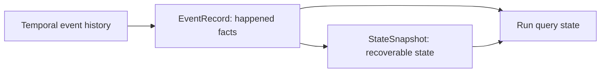

原则：

- Temporal history 负责可靠执行恢复。
- EventRecord 负责平台审计和业务可见事件。
- StateSnapshot 负责 agent/workflow state 查询和恢复辅助。
- Run / StepRun 维护查询态，不作为唯一事实来源。
- Workflow 层 snapshot 默认按节点边界保存，Agent 层 checkpoint 按 `checkpointPolicy` 选择性保存。
- Temporal 不作为业务状态查询源；业务查询通过 Postgres 中的 Run / StepRun / StateSnapshot / TraceSpan 完成。

### 5.4 核心表建议

第一版核心表：

```text
tenants
workspaces
users

workflow_definitions
workflow_versions
workflow_manifests
graph_specs
node_specs
edge_specs

agent_definitions
agent_versions
skill_definitions
skill_versions
prompt_templates
prompt_versions

tool_definitions
tool_versions
mcp_servers
model_providers
model_profiles
connections
secret_refs

policy_definitions
policy_versions
policy_bindings

runs
step_runs
invocations
transition_decisions
state_snapshots
agent_checkpoints
agent_thread_states
agent_memories
embedding_records
artifacts
human_tasks
event_records
trace_spans
evaluation_results
cost_records
```

### 5.5 关键索引

建议索引：

```text
workflow_versions(workflow_definition_id, version)
workflow_versions(status, published_at)

runs(workflow_version_id, status, started_at)
runs(workspace_id, status, started_at)
runs(temporal_workflow_id)

step_runs(run_id, node_spec_id, attempt)
step_runs(run_id, status)

invocations(step_run_id, kind)
invocations(target_ref, created_at)

state_snapshots(run_id, checkpoint_key, created_at)
agent_checkpoints(run_id, step_run_id, created_at)
agent_thread_states(thread_id, updated_at)
agent_memories(workspace_id, agent_version_id, memory_key)
embedding_records(workspace_id, collection, embedding)
event_records(run_id, created_at)
human_tasks(assignee, status, due_at)
cost_records(run_id, created_at)
```

说明：

- `embedding_records(embedding)` 依赖 Postgres 的向量能力扩展，例如 pgvector；如果不启用向量检索，也可以先只保存 embedding 元数据和原文。
- LangGraph checkpoint 可以直接映射到 `agent_checkpoints` / `agent_thread_states`，避免为第一版额外引入独立 checkpoint 存储。

## 6. 关键运行流程

### 6.1 发布 WorkflowVersion

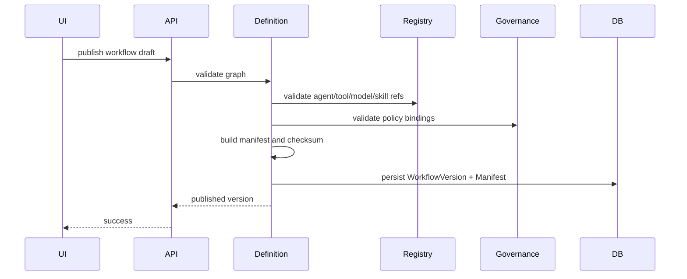

发布校验包括：

- Graph entry/end 合法。
- Node executorRef 存在。
- Agent 引用的 skill/tool/model 存在且 published。
- Tool schema 和 Node input/output mapping 兼容。
- PolicyBinding scope 合法。
- 高风险工具必须有审批或显式授权策略。

### 6.2 启动 Run

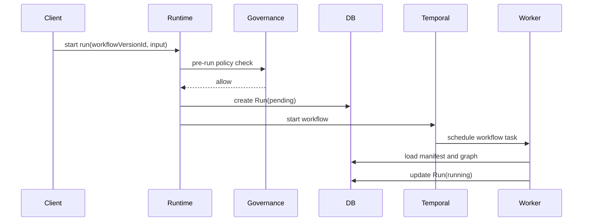

### 6.3 service 与 worker 的交互模型

`agentrail-service` 和 `agentrail-worker` 不直接通过 RPC 交互。推荐边界是：

```text
service 不直接调用 worker
worker 不暴露业务 RPC
Temporal 是 service 和 worker 的调度边界
Postgres 是 service 和 worker 的状态可见边界
```

职责划分：

- `agentrail-service`：创建 Run、启动 Temporal Workflow、发送 signal、取消/暂停/恢复、处理 HumanTask 输入、提供查询 API。
- `agentrail-worker`：被 Temporal 调度，加载 WorkflowVersion / Manifest，执行 NodeSpec，写 StepRun / Invocation / StateSnapshot / TransitionDecision，调用模型和工具。

粒度约定：

- `Run` = 一个 Temporal Workflow Execution。
- `Workflow Node` = 一个业务阶段，对应一个 `StepRun`。
- `StepRun` = 通常一个或多个 Temporal Activity。
- `Agent` 内部步骤 = `Invocation` / `TraceSpan` / `StateSnapshot`。
- `human` / `wait` 节点 = Temporal 等待 signal，不占用 worker 线程。

状态约定：

- Worker 进程本身无状态，可以崩溃、重启、横向扩展。
- Run 的可靠执行状态由 Temporal 保存。
- 平台查询态、Agent checkpoint、thread state、memory、trace、cost 由 Postgres 保存。
- 大型 Artifact 由对象存储保存。

service 查询时不只看到最终结果，而是可以按需要查看：

- Run 级别：整体状态、当前节点、最终输入输出。
- StepRun 级别：每个业务阶段的状态、输入输出、错误、重试、耗时。
- Invocation / Trace 级别：Agent 内部模型调用、工具调用、中间产物、成本和 checkpoint。

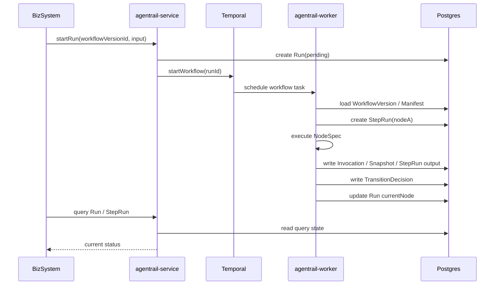

### 6.4 执行 Agent Node

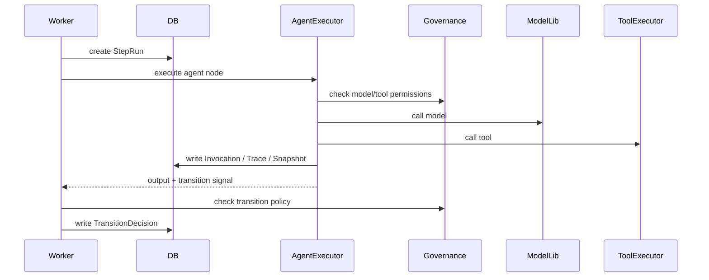

Agent Node 对外仍是一个 `StepRun`，但内部可以有多轮模型调用、工具调用、反思、改写和 checkpoint。Agent 内部步骤不应该膨胀为 Workflow Node，而应该作为 trace 和 invocation 记录。

## 7. 演进原则与待决问题

### 7.1 演进原则

- 领域模型优先于具体引擎。LangGraph 是 AgentExecutor 的实现，不是平台领域模型。
- 新增流程靠发布定义和版本，不靠新增 worker 代码。
- 新增业务流程不改 worker；新增平台能力类型才扩展 worker。
- Workflow Node 表示业务阶段边界，Agent Step 表示运行时执行轨迹。
- `agentrail-service` 和 `agentrail-worker` 通过 Temporal 与 Postgres 解耦，不建立直接业务 RPC。
- 所有外部副作用都必须通过 Tool / Activity / Policy。
- 所有可复用能力都版本化。
- 所有运行决策都可解释、可审计、可回放。
- Agent 的自主性必须是被授权的自主性。

### 7.2 待决问题

以下问题已经形成第一版决策：

- GraphSpec 第一版不支持嵌套 graph；流程复用和组合通过 `subflow` node 指向独立 `WorkflowVersion` 表达。
- Agent 内部 LangGraph trace 映射为平台统一 `TraceSpan`；第一版 TraceSpan 直接写 Postgres，不绑定具体 agent runtime。
- StateSnapshot 粒度默认以 Workflow Node 边界为主；Agent 内部 checkpoint 按 `checkpointPolicy` 选择性保存。Temporal 负责可靠执行恢复，Postgres 负责业务查询态、snapshot、checkpoint 和 trace。

以下问题仍需要在下一轮设计中继续明确：

- WorkflowVersion 升级时，运行中 Run 是否允许迁移到新版本。
- Policy 规则语言采用自研 DSL、CEL、OPA/Rego，还是代码化策略。
- MCP 工具 schema 如何同步、缓存和版本化。
- Skill 的执行语义是纯提示增强，还是允许包含可执行 planning template。
- 多模态产物的存储、权限和生命周期如何治理。

